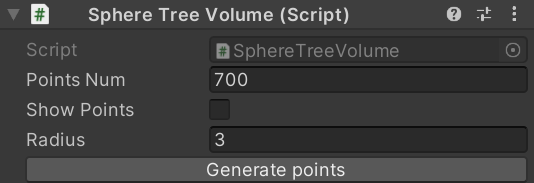
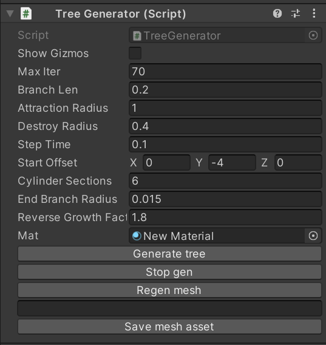
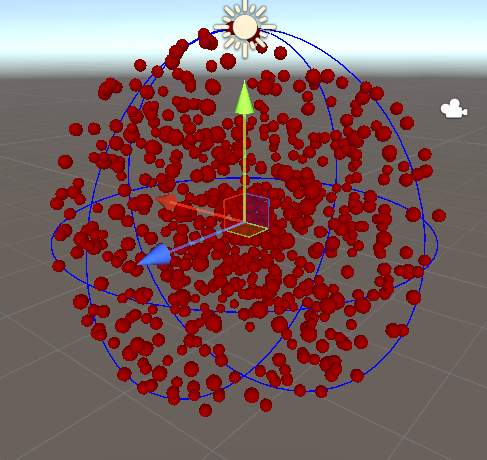
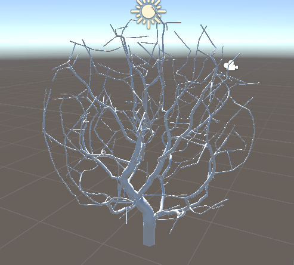
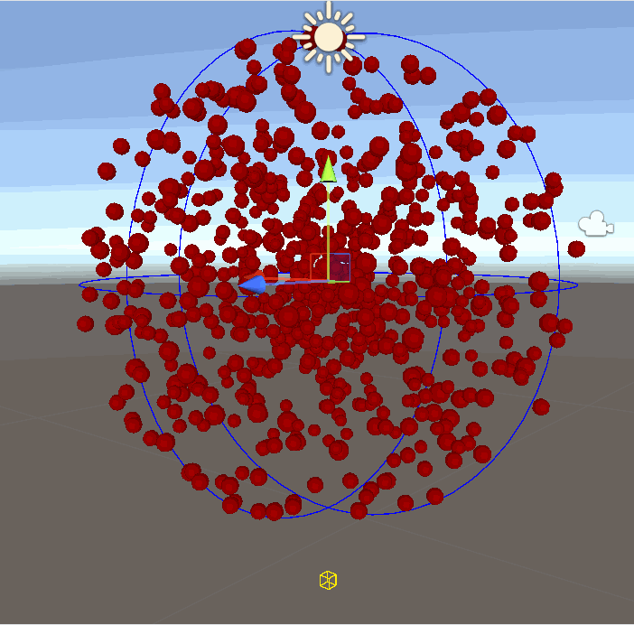

# Procedural Generation

## <h2 id="top">Summary</h2>
-[Currently implemented](#implements)  
-[WIP](#wip)  
-[Instructions](#instructions)  
-[Screenshots](#screens)  
-[Sources](#references)  

## <h2 id="implements">Currently implemented</h2>
Custom Random Number Generator (LCG)  
Terrain Generation (Marching Cubes algorithm)  
Procedural tree generation (Space colonization algorithm)  

## <h2 id="wip">WIP</h2>
Other random number generation algorithms  
Spatial acceleration for tree generator (Octree, etc...)  

## <h2 id="instructions">Instructions</h2>
### Random Number Generation

Random Number Generation can be used in scripts using the static class `RNG`. The seed for the generator can be set by calling `SetSeed()`, the type of generator by calling `SetRandomType()` by passing a value from the enum `RandomTypes`. Random numbers in a certain range can be obtained by calling `Rand`, which is overloaded for both integers and floats. Currently, the only generator type implemented is LCG (Linear Congruential Generator).  
An object called "Tests" is located in the SampleScene, with a component called `RNGTests`. This object starts a few unit tests when entering play mode to ensure the generator functions properly.  

### Tree Generation

Trees can be generated from any game objects that has a `TreeVolume` component, a `TreeGenerator` component, and a `MeshFilter`. 
First, the `TreeVolume` class is an empty class with static members, to allow for easy implementation of new volume shapes and distributons. The volume that needs to be attached is `SphereTreeVolume`.  
In the volume editor, you can set the number of points (leaves) the tree generator will use as a target, toggle the visibility of said points' gizmos, and, specifically for the sphere volume, you can set the radius of the volume in which the points will be spread out.
  
In the generator editor, you can toggle the gizmos that show the tree mid generation, set a maximum number of iterations (in case of the parameters not being able to finish the tree), the length of the branches and the attraction and destruction radius used for the generation. Step time defines the minimum amount of time between each step in the generation, useful to visualize the growth. Start offset sets the location of the first branch based on the game object's origin. This starting point is represented by a yellow wireframe cube in the gizmos.  
Cylinder sections defines the number of sections the cylinder mesh wrapping around each branch will have. End branch radius sets the radius of each extremity of the tree. Reverse growth factor defines the factor used to grow the branches mesh when far from the extremities. The higher the value, the thinner the base will be. Recommended between 1.4 and 2 for an end radius of 0.015.  
Finally, Generate tree will start the tree's generation, resetting the volume's points if need be. It will also generate the mesh once the growth has ended. Stop gen is used to stop the generation prematurely, in case of setting wrong parameters that won't lead to a decent tree. Regen mesh will regenerate the mesh without regenerating the tree, useful for iteration on mesh related parameters. The empty text field is the name of the asset created by Save mesh asset, in the folder "Assets/Meshes/TreeGen". If left empty, the asset name will be Tree[0-9999], attributed randomly.   
  

### Terrain Generation

Terrain can be generated with a custom tool which uses marchin cube algorithm. This tool can be accessed in the Component -> Tool tab of the editor.
This algorithm uses perlin noise as a height map to create a layer of points, this layer of point is then stored as a three dimentional matrix so that all the coordinates of our points are eaily accessible. Once the matrix generated the `map` script will itterate on small portions of it with a cubic filter hense the name Marching cube, each itteration will take each corners and check if one of our stored points correspond to the corner's coordinates, once all corners have been assessed the algorithm will make one of 256 possible patterns and thanks to it will generate triangles data according to the pattern's corners. Once all itterations are done the script all the triangles data are passed to a Mesh filter in order to generate a new mesh, additionally the same data is sent to a Mesh collider to generate the map's collisions.

The generator uses:
- A Vector3 for the map's dimentions (values have to be positive and above 0)
- An Int for the map's seed
- A float for the scale, the higher the value the more zoomed in the map will be
- A map script which the user have to add themselves from the scene
 

Once the map generated, the `map` script allows you to display the points that generated the map with the `Is Visible` boolean, enabling it will display colored gizmo spheres

## <h2 id="screens">Screenshots</h2>  

Points repartition in the volume  
  

A tree procedurally generated  
  

A quick generation of a tree with 700 points  
  

Generated map with `MapGenerator` parameters

Visible map points with `Is Visible` boolean enabled

## <h2 id="references">Sources</h2>  

### Random Number Generator
- [LCG Wikipedia page](https://en.wikipedia.org/wiki/Linear_congruential_generator)  

### Tree generator
- [Ciphrd blog post](https://ciphrd.com/2019/09/11/generating-a-3d-growing-tree-using-a-space-colonization-algorithm/)
- [Space colonization research paper, University of Calgary](https://algorithmicbotany.org/papers/colonization.egwnp2007.large.pdf)